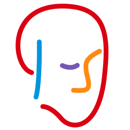
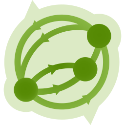
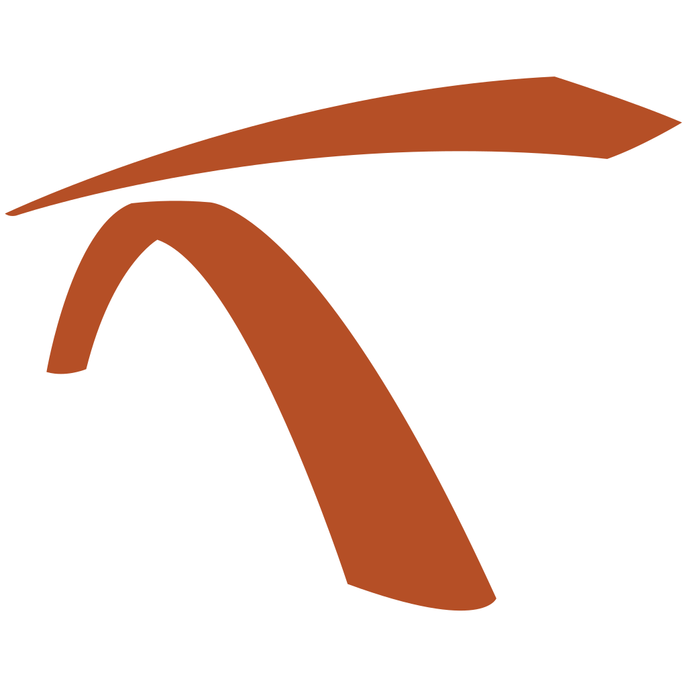

<!--
  Licensed to the Apache Software Foundation (ASF) under one
  or more contributor license agreements.  See the NOTICE file
  distributed with this work for additional information
  regarding copyright ownership.  The ASF licenses this file
  to you under the Apache License, Version 2.0 (the
  "License"); you may not use this file except in compliance
  with the License.  You may obtain a copy of the License at

    http://www.apache.org/licenses/LICENSE-2.0

  Unless required by applicable law or agreed to in writing,
  software distributed under the License is distributed on an
  "AS IS" BASIS, WITHOUT WARRANTIES OR CONDITIONS OF ANY
  KIND, either express or implied.  See the License for the
  specific language governing permissions and limitations
  under the License.
  -->

# Apache KIE

<p align="left"></p>

This is the main repository for [Apache KIE](https://kie.apache.org) (incubating). It contains the source code for:

- [**Drools**](https://kie.apache.org/components/drools/) — a rule engine, DMN engine, and complex event processing (CEP) engine for Java. 
- [**OptaPlanner**](https://kie.apache.org/components/optaplanner/) — a constraint solver for Java.
- [**jBPM**](https://kie.apache.org/components/jbpm/) — a workflow engine, and BPMN engine for Java.
- [**Kogito**](https://kie.apache.org/components/kogito/) — a cloud-native runtime for highly scalable business automation solutions based on Drools and jBPM. Available for [Quarkus](https://quarkus.io), and [Spring Boot](https://spring.io/projects/spring-boot).

---

## Drools

<p align="left"></p>

The rule engine in Drools is a business rule management system with a forward-chaining and backward-chaining inference, allowing fast and reliable evaluation of business rules and complex event processing. A rule engine is also a fundamental building block to create an expert system which, in artificial intelligence, is a computer system that emulates the decision-making ability of a human expert.

Rules are defined in the [DRL language](https://kie.apache.org/docs/10.2.x/drools/drools/language-reference/index.html), as source code or as Decision Table spreadsheets in Excel format.

The decision engine in Drools executes decision models. Decision models are a fundamental building block to separate decision logic from application code and put it in the hands of business experts.

Decisions models are defined in the [DMN notation](https://www.omg.org/spec/DMN/) with expressions written in the [FEEL language](https://kiegroup.github.io/dmn-feel-handbook/#dmn-feel-handbook).

The complex event processing (CEP) engine in Drools detects patterns in streams of events, correlating facts over time with temporal operators, sliding windows, and automatic event expiration. It is a fundamental building block to react to situations that emerge from the combination of many events over time — such as fraud detection, systems monitoring, and IoT applications — rather than from any single event alone.

Event processing rules are defined in the DRL language too, with facts declared as events and evaluated by the rule engine running in stream mode.

## OptaPlanner

<p align="left"></p>

The constraint solver in OptaPlanner optimizes planning and scheduling problems, such as vehicle routing, employee rostering, task assignment, and school timetabling. It combines optimization heuristics and metaheuristics — such as tabu search, simulated annealing, and late acceptance — with very efficient incremental score calculation to find good solutions to NP-hard problems in reasonable time.

Planning problems and their constraints are defined in plain Java, with domain classes annotated as planning entities and score rules written with the Constraint Streams API or in the DRL language.

## jBPM

<p align="left"></p>

The workflow engine in jBPM allows the definition and execution of business processes, bridging the gap between business analysts and developers by describing process logic in a notation both can understand. It supports long-running, stateful processes with human tasks, timers, events, and compensation, making it a fundamental building block to automate and monitor end-to-end business workflows.

Processes are defined in the [BPMN 2.0](https://www.omg.org/spec/BPMN/2.0/) notation.

## Kogito

<p align="left"></p>

The runtime in Kogito executes business automation solutions as cloud-native microservices, building on [Quarkus](https://quarkus.io) and [Spring Boot](https://spring.io/projects/spring-boot) to deliver fast startup, low footprint, and native compilation with GraalVM. It turns business assets into runnable microservices through build-time code generation, making it a fundamental building block to deploy rules, decisions, and processes as highly scalable microservices.

Kogito microservices are built using the same assets used by Drools and jBPM — DRL rules, DMN decisions, and BPMN 2.0 processes.

---

## Releases

Officially, Apache KIE releases are source code releases. They are available at the
[Apache KIE :: Downloads](https://kie.apache.org/downloads), or directly at
[downloads.apache.org/incubator/kie](https://downloads.apache.org/incubator/kie/), signed with the keys in
[KEYS](https://downloads.apache.org/incubator/kie/KEYS) — see the
[verification instructions](https://www.apache.org/info/verification.html).

For convenience, binary artifacts are published to [Maven Central](https://central.sonatype.com) under the following groupIds:

- `org.kie`
- `org.drools`
- `org.jbpm`
- `org.optaplanner`
- `org.kie.kogito`

To manage the versions of individual artifacts on your projects, import one of the BOMs:

- `org.drools:drools-bom`
- `org.optaplanner:optaplanner-bom`
- `org.kie.kogito:kogito-bom`

> There is no separate BOM for jBPM: its engine runs as part of Kogito, so the `org.jbpm` artifacts are managed by `org.kie.kogito:kogito-bom`.

All artifacts of a release share the same version, regardless of groupId.

## Documentation

For the documentation of Drools, OptaPlanner, jBPM, and Kogito, please see [Apache KIE :: Documentation](https://kie.apache.org/documentation)

Documentation about this repository itself — its structure, build, and conventions — lives in the [docs/](./docs/README.md) directory.

## Get involved

- Mailing lists:
  - [users@kie.apache.org](https://lists.apache.org/list.html?users@kie.apache.org) ([subscribe](mailto:users-subscribe@kie.apache.org)) — questions about using Apache KIE
  - [dev@kie.apache.org](https://lists.apache.org/list.html?dev@kie.apache.org) ([subscribe](mailto:dev-subscribe@kie.apache.org)) — development discussions
  - [commits@kie.apache.org](https://lists.apache.org/list.html?commits@kie.apache.org) ([subscribe](mailto:commits-subscribe@kie.apache.org)) — commit notifications
- Chat:
  - [Apache KIE @ Zulip](https://kie.zulipchat.com)
  - [Kogito @ Google Group](https://groups.google.com/g/kogito-development)
- Issues:
  - [apache/incubator-kie](https://github.com/apache/incubator-kie/issues) — this repository's issue tracker
  - [apache/incubator-kie-issues](https://github.com/apache/incubator-kie-issues/issues) — existing issues
- New to Apache? Check out:
  - [The Apache Way](https://www.apache.org/theapacheway/)
  - [Apache Newcomers guide](https://community.apache.org/newcomers/)
  - [Apache Incubator](https://incubator.apache.org)

## Building and contributing

```bash
git clone https://github.com/apache/incubator-kie.git
cd incubator-kie
mvn clean install -DskipTests
```

See [CONTRIBUTING.md](./CONTRIBUTING.md) for the contribution guide, and [docs/BUILDING.md](./docs/BUILDING.md) for build flags, test profiles, and troubleshooting.

## License

Licensed under the [Apache License, Version 2.0](./LICENSE).

---

Apache KIE (incubating) is an effort undergoing incubation at The Apache Software Foundation (ASF), sponsored by the name of Apache Incubator. Incubation is required of all newly accepted projects until a further review indicates that the infrastructure, communications, and decision making process have stabilized in a manner consistent with other successful ASF projects. While incubation status is not necessarily a reflection of the completeness or stability of the code, it does indicate that the project has yet to be fully endorsed by the ASF.

Some of the incubating project’s releases may not be fully compliant with ASF policy. For example, releases may have incomplete or un-reviewed licensing conditions. What follows is a list of known issues the project is currently aware of (note that this list, by definition, is likely to be incomplete):

Some files, particularly test files, and those not supporting comments, may be missing the ASF Licensing Header
If you are planning to incorporate this work into your product/project, please be aware that you will need to conduct a thorough licensing review to determine the overall implications of including this work. For the current status of this project through the Apache Incubator visit: https://incubator.apache.org/projects/kie.html
